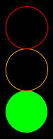
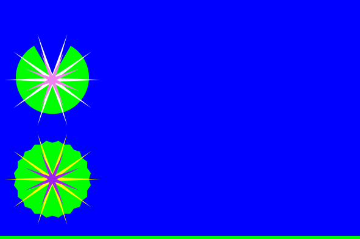
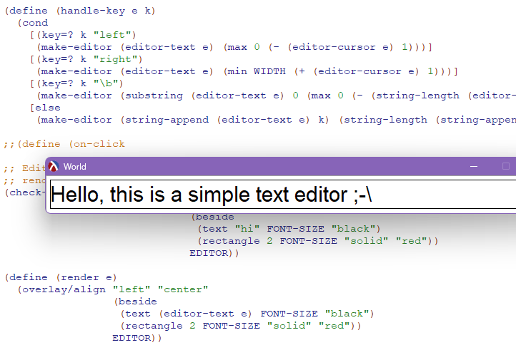
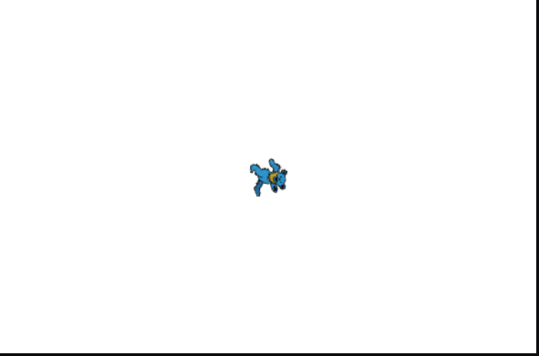
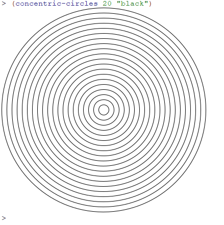
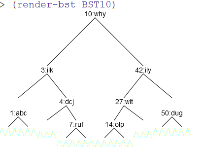
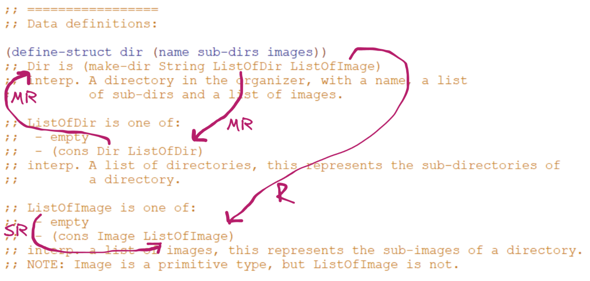
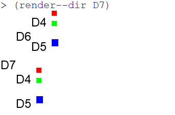

# Systematic Program Design

These are some small projects for the Systematic Program Design course.

## [Traffic Lights](./1-traffic-lights.rkt)

## [Water Lilies](./2-nenuphar.rkt)

## [Simple Text Editor](./3-editor.rkt)

## [Spinning Bears](./4-spinning-bears.rkt)

## [Concentric Circles](./5a-naturals/concentric-circles.rkt)

## [Rain](./5b-helpers//making-rain-filtered.rkt)

## [Binary Search Tree Rendering](./6a-binary-search-trees/render-bst-w-lines.rkt)

## [Image Organizer]

