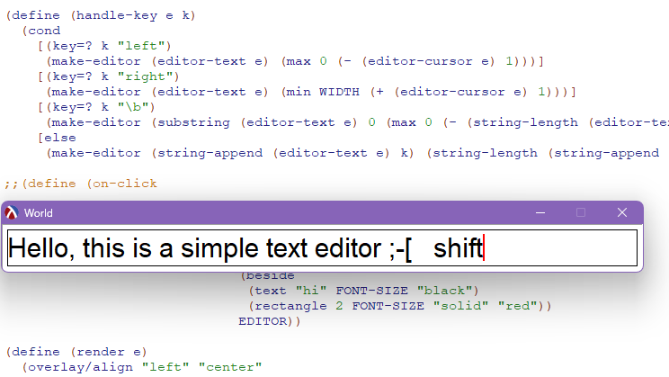

# Systematic Program Design

These are some small projects for the Systematic Program Design course.

## [Traffic Lights](./1-traffic-lights.rkt)

## [Water Lilies](./2-nenuphar.rkt)

## [Simple Text Editor](./3-editor.rkt)

## [Spinning Bears](./4-spinning-bears.rkt)

## [Concentric Circles](./5a-naturals/concentric-circles.rkt)
